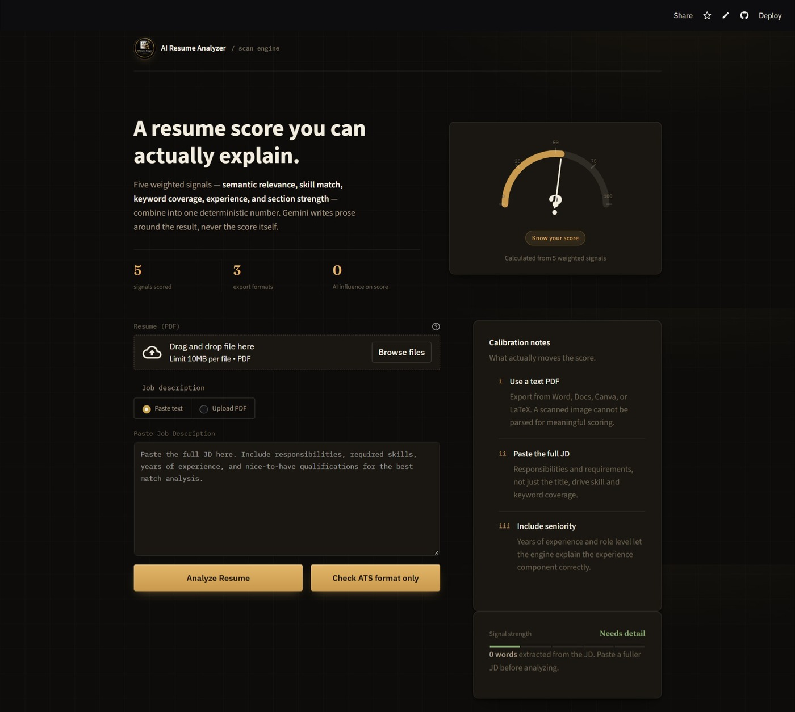
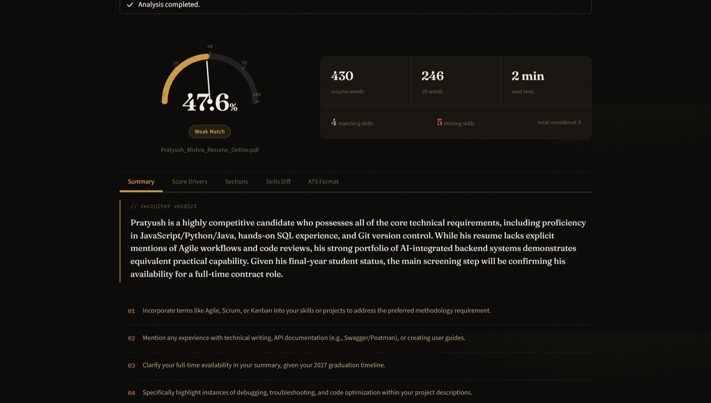
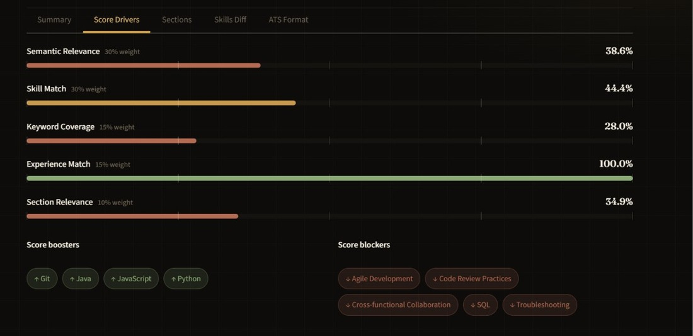
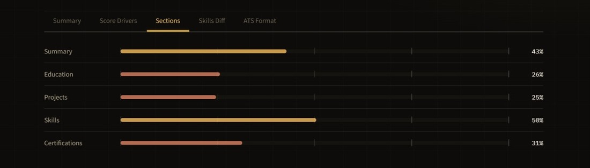
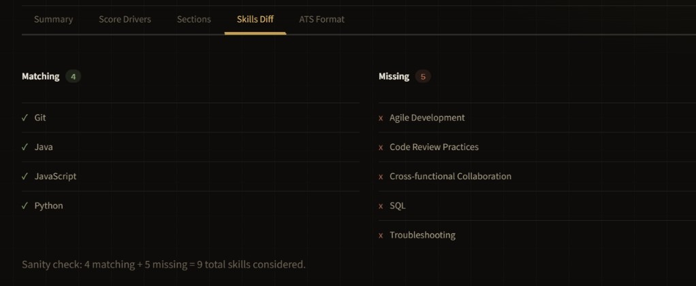
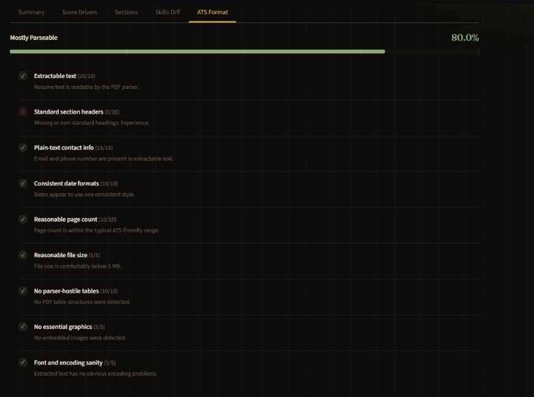
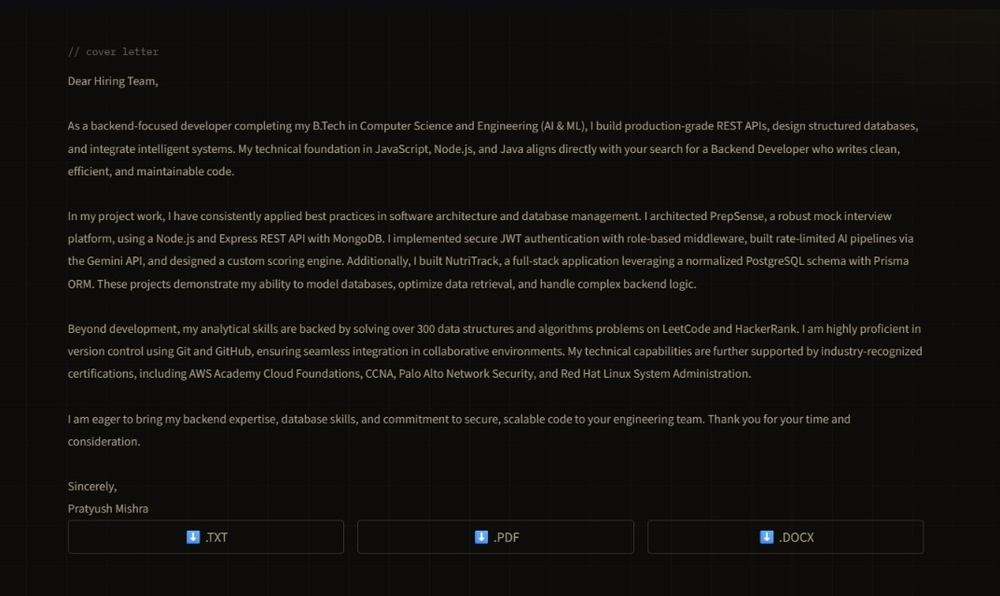

# 📄 AI Resume Analyzer

An AI-powered ATS Resume Analyzer that scores a resume against a Job Description using a **deterministic, explainable hybrid scoring engine**, then layers **Google Gemini** on top for qualitative feedback — matching/missing skills, suggestions, and a recruiter-style verdict. It can also generate a tailored cover letter and rewrite the resume itself for a specific JD.

**🔗 Live demo:** [ai-resume-analyzer-pratyushm206.streamlit.app](https://ai-resume-analyzer-pratyushm206.streamlit.app/)

---

## ✨ Features

- 📄 Upload Resume (PDF)
- 📝 Paste Job Description or upload a text-based JD PDF
- ⏳ Staged progress feedback while text extraction, JD analysis, skill matching, and result construction run
- ⏱ Gemini calls have a 45-second timeout guardrail with user-facing retry guidance
- 🎯 Hybrid ATS Match Score — deterministic and reproducible (same resume + same JD → same score, every time)
- 🔍 Explainable "Why This Score?" breakdown — semantic relevance, skill match, keyword coverage, experience match, and section relevance, each shown with its weight
- 📊 Section-wise Resume Scoring (Summary, Education, Projects, Skills, Certifications)
- 🧾 JD-independent ATS Format/Compatibility Checker for parseability, contact info, sections, dates, file size, page count, tables, images, and text extraction
- ✅ Matching Skills / ❌ Missing Skills
- 💡 AI-generated Improvement Suggestions
- 🧑‍💼 AI-generated Recruiter Verdict
- ⬇️ Downloadable PDF Analysis Report
- ✉️ AI-generated Cover Letter
- 📄 Cover letter export as TXT, PDF, and DOCX
- 📝 AI Resume Tailoring — rewrites the resume for a specific JD without inventing skills or experience
- 📈 Before/after ATS comparison for tailored resumes, including component deltas and skill-invention guardrails
- 🧪 Pytest coverage for scoring, section splitting, document exports, Gemini response parsing, and format checks
- 💾 Session-persisted results across Streamlit reruns
- 🖤 Custom dark, terminal-inspired dashboard UI

---

## 🛠 Tech Stack

### Frontend
- Streamlit
- Custom CSS + component library (`frontend/styles.py`, `frontend/components.py`)

### ATS Scoring Engine (`ats_engine.py`)
A deterministic scoring pipeline — this is what actually produces the numeric score. Gemini is used only for interpretation and prose, never for the number itself, so the score stays reproducible.

| Component | Weight | Method |
|---|---|---|
| Semantic Relevance | 30% | Sentence Transformers embeddings + cosine similarity |
| Skill Match | 30% | Curated skill vocabulary with alias/variant matching (e.g. "React", "React.js", "reactjs" → one canonical skill) |
| Keyword Coverage | 15% | Frequency-ranked JD keyword overlap |
| Experience Match | 15% | Regex-based extraction of required vs. candidate years of experience |
| Section Relevance | 10% | Per-section resume scoring (via `resume_sections.py`) |

### AI / NLP
- Sentence Transformers (`all-MiniLM-L6-v2`)
- Google Gemini API — matching/missing skills, suggestions, recruiter verdict, cover letter generation, resume tailoring

### Backend
- Python

### PDF Processing
- PyMuPDF — resume text extraction
- ReportLab — analysis report generation

---

## 🏗 Project Architecture

```
Resume PDF
      │
      ▼
   PyMuPDF
      │
Extracted Text
      │
      ├─────────────────────────────┐
      │                             │
      ▼                             ▼
  ATS Engine                Google Gemini
  (deterministic)            (qualitative)
      │                             │
      ├── Semantic Relevance        ├── Matching Skills
      ├── Skill Match                ├── Missing Skills
      ├── Keyword Coverage           ├── Suggestions
      ├── Experience Match           └── Recruiter Verdict
      ├── Section Relevance
      │
      ▼
 Weighted ATS Score
 + Explainable Breakdown
      │
      ▼
   Dashboard UI
      │
      ├── PDF Report (ReportLab)
      ├── Cover Letter (Gemini)
      └── Tailored Resume (Gemini)
```

---

## 📂 Project Structure

```
AI-Resume-Analyzer/
│
├── app.py                     # Streamlit entry point
├── ats_engine.py               # Deterministic hybrid ATS scoring engine
├── ai_engine.py                 # Sentence-transformers model + cosine similarity (used by ats_engine and resume_sections)
├── format_checker.py            # JD-independent ATS parseability checker
├── tailor_compare.py            # Before/after tailored resume comparison
├── gemini_engine.py            # Gemini-based qualitative analysis
├── cover_letter_engine.py      # Gemini-based cover letter generation
├── resume_tailor_engine.py     # Gemini-based resume tailoring
├── resume_sections.py          # Resume section splitting + per-section scoring
├── report_generator.py         # PDF report generation (ReportLab)
├── frontend/
│   ├── styles.py                # CSS
│   └── components.py            # UI components
├── tests/
├── .streamlit/config.toml
├── requirements.txt
├── .env.example
├── .gitignore
└── README.md
```

---

## ⚙️ Installation

Clone the repository

```bash
git clone https://github.com/pratyushm206/AI-Resume-Analyzer.git
```

Go to the project directory

```bash
cd AI-Resume-Analyzer
```

Create virtual environment

```bash
python -m venv venv
```

Activate virtual environment

### Windows

```bash
venv\Scripts\activate
```

Install dependencies

```bash
pip install -r requirements.txt
```

---

## 🔑 Environment Variables

Create a `.env` file

```env
GEMINI_API_KEY=YOUR_API_KEY
```

---

## ▶️ Run the Project

```bash
streamlit run app.py
```

---

## 🧪 Running Tests

```bash
pytest
```

Tests mock Gemini and the Sentence Transformers model so they do not call external services.

---

## 🚀 Streamlit Community Cloud Deployment

1. Push the repository to GitHub.
2. Create a new Streamlit Community Cloud app and select `app.py` as the entry point.
3. Add `GEMINI_API_KEY` in Streamlit Cloud Secrets.
4. Deploy. Dependencies are installed from `requirements.txt`; no extra system packages are currently required.

The app also supports local development through `.env` with the same `GEMINI_API_KEY` name.

---

## 🔮 Roadmap

- Keep growing the curated skill vocabulary from real JD misses captured in `unrecognized_skills.log`.

---

## 📸 Demo

Try it live: **[ai-resume-analyzer-pratyushm206.streamlit.app](https://ai-resume-analyzer-pratyushm206.streamlit.app/)**

### Scan Engine

| Landing / Input | Score, Verdict & Suggestions |
|---|---|
|  |  |

### Explainable Breakdown

| Score Drivers | Section-wise Scoring |
|---|---|
|  |  |

| Skills Diff | ATS Format Check |
|---|---|
|  |  |

### AI-Generated Cover Letter



---

## 👨‍💻 Author

**Pratyush Mishra**

- GitHub: https://github.com/pratyushm206
- LinkedIn: https://www.linkedin.com/in/pratyush-mishra-211327296

---

⭐ If you found this project useful, consider giving it a star.
